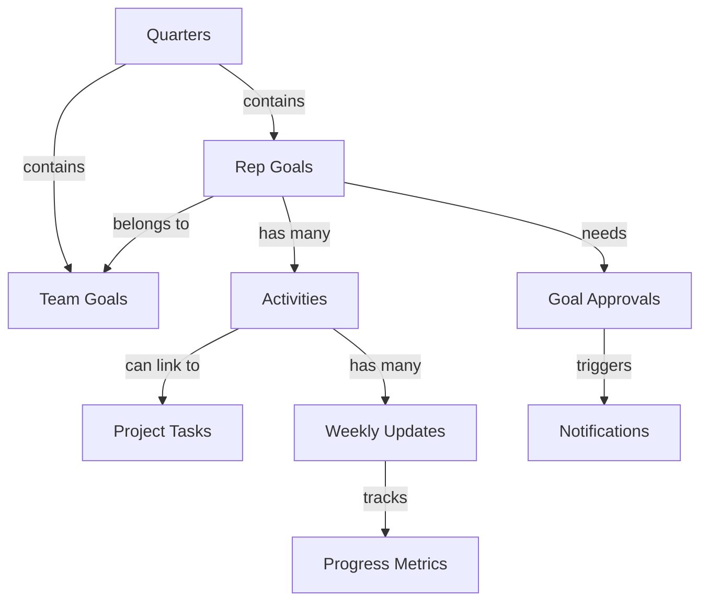

# Pull Request: Accountability Chart Module

## 📋 Overview

This PR implements a comprehensive **Quarterly Accountability Chart** system for the BD team, enabling tracking of quarterly goals, weekly activities, and progress monitoring with a complete approval workflow.

## 🎯 Purpose

Enable BD reps to:
- Define quarterly goals that contribute to team objectives
- Break goals into trackable activities with weekly commitments
- Submit progress updates with status tracking (On Track, At Risk, Off Track)
- Link activities to existing tasks in the task management system
- Request manager approval for goals

Enable Managers to:
- Set team-level quarterly goals
- Approve or reject individual rep goals with feedback
- Monitor team progress across all goals and activities
- Receive notifications when goals need approval

## ✨ Features Implemented

### 1. **Quarterly Goal Management**
- Create and manage quarterly periods (Q1 2026, Q2 2026, etc.)
- Set team-level goals with numeric targets
- Propose individual rep goals with optional team goal linkage
- Approval workflow: Draft → Pending Approval → Approved/Rejected

### 2. **Activity Tracking**
- Break goals into specific activities
- Define frequency (daily, weekly, biweekly, monthly, one-time)
- Set target counts and track current progress
- Link activities to existing project tasks
- Pause or complete activities

### 3. **Weekly Progress Updates**
- Submit weekly updates for each activity
- Track numeric progress and percentage completion
- Report status changes (On Track, At Risk, Off Track)
- Document blockers and help needed
- Add notes for context

### 4. **Progress Visualization**
- Real-time progress bars and charts
- Automatic rollup: Activities → Rep Goals → Team Goals
- Status badges with color coding
- Timeline view of weekly updates

### 5. **Notifications**
- Managers notified when goals submitted for approval
- Reps notified when goals approved/rejected
- In-app notifications with navigation links

### 6. **Full Team Visibility**
- All authenticated users can view all goals and progress
- Filter by rep, status, approval status
- Dedicated views for managers to see team-wide progress

## 🗂️ Files Changed

### Database Migration
- **`supabase/migrations/20260121000000_create_accountability_chart.sql`** (NEW)
  - 5 new tables with full RLS policies
  - Automatic progress calculation triggers
  - Status auto-calculation based on progress vs. timeline
  - Notification triggers for approval workflow

### Backend Hooks (4 new files)
- **`src/hooks/useAccountabilityQuarters.tsx`** (NEW)
- **`src/hooks/useAccountabilityGoals.tsx`** (NEW)
- **`src/hooks/useAccountabilityActivities.tsx`** (NEW)
- **`src/hooks/useAccountabilityUpdates.tsx`** (NEW)

### UI Components (15 new files)
- **`src/components/accountability/QuarterSelector.tsx`** (NEW)
- **`src/components/accountability/TeamGoalsList.tsx`** (NEW)
- **`src/components/accountability/RepGoalsList.tsx`** (NEW)
- **`src/components/accountability/GoalApprovalQueue.tsx`** (NEW)
- **`src/components/accountability/GoalForm.tsx`** (NEW)
- **`src/components/accountability/GoalStatusBadge.tsx`** (NEW)
- **`src/components/accountability/ActivityList.tsx`** (NEW)
- **`src/components/accountability/ActivityForm.tsx`** (NEW)
- **`src/components/accountability/WeeklyUpdateForm.tsx`** (NEW)
- **`src/components/accountability/WeeklyUpdateTimeline.tsx`** (NEW)
- **`src/components/accountability/GoalProgressChart.tsx`** (NEW)

### Pages (2 new files)
- **`src/pages/bd/AccountabilityChart.tsx`** (NEW)
- **`src/pages/bd/AccountabilityGoalDetail.tsx`** (NEW)

### Modified Files
- **`src/App.tsx`** - Added routing for `/bd/accountability` and `/bd/accountability/:goalId`
- **`src/components/Layout.tsx`** - Added "Accountability Chart" to Daily Work navigation section

## 🏗️ Architecture

## 🔒 Security & Permissions

All implemented with Row-Level Security (RLS):

**SELECT (View):** All authenticated users can view all data (full transparency)

**INSERT (Create):**
- Quarters: Managers/Admins only
- Team Goals: Managers/Admins only
- Rep Goals: Reps can create their own, Managers can create for anyone
- Activities: Goal owner only
- Weekly Updates: Activity's goal owner only

**UPDATE (Edit):**
- Quarters: Managers/Admins only
- Team Goals: Managers/Admins only
- Rep Goals: Owner (for status/progress), Managers (for approval)
- Activities: Goal owner only
- Weekly Updates: Update owner only

**DELETE:** Managers/Admins only for all tables

## 🧪 Testing Instructions

### Prerequisites
1. Ensure you're on the `feature/accountability-chart` branch
2. Run the database migration: The new migration will run automatically on deployment

### Test Scenarios

#### As a BD Rep:
1. **Create a Goal**
   - Navigate to `/bd/accountability`
   - Click "My Goals" tab
   - Click "Add Goal"
   - Fill in title, description, target value, and unit
   - Optionally link to a team goal
   - Click "Create Goal"
   - ✅ Goal should appear with "Draft" status

2. **Submit Goal for Approval**
   - Find your draft goal
   - Click the Send icon (Submit for Approval)
   - ✅ Status should change to "Pending Approval"
   - ✅ Managers should receive a notification

3. **Add Activities**
   - Click on your goal (must be approved first)
   - Click "Add Activity"
   - Fill in activity details
   - Optionally link to an existing task
   - ✅ Activity should appear in the list

4. **Submit Weekly Update**
   - Click on an activity
   - Submit weekly progress with:
     - Progress value (numeric work completed)
     - Progress percentage
     - Status
     - Blockers (if any)
     - Help needed (if any)
   - ✅ Update should appear in timeline
   - ✅ Activity progress should update
   - ✅ Goal progress should auto-update

#### As a Manager:
1. **Create Quarter**
   - Navigate to `/bd/accountability`
   - Click the "+" button next to quarter selector
   - Create a new quarter (e.g., "Q1 2026")
   - Set start and end dates
   - ✅ Quarter should be created and selectable

2. **Create Team Goal**
   - Select a quarter
   - Go to "Team Goals" tab
   - Click "Add Team Goal"
   - Set team-level target
   - ✅ Goal should appear in team goals list

3. **Approve/Reject Goals**
   - Go to "Approvals" tab
   - Review pending goals
   - Click "Approve" or "Reject"
   - If rejecting, provide a reason
   - ✅ Rep should receive notification
   - ✅ Goal status should update

4. **Monitor Team Progress**
   - Go to "Team Progress" tab
   - View all rep goals with filters
   - ✅ See all team members' goals and progress

### Edge Cases to Test
- ✅ Cannot submit goal for approval twice
- ✅ Cannot edit approved goals (except progress)
- ✅ Cannot create activities for unapproved goals
- ✅ Progress auto-calculates and rolls up correctly
- ✅ Status changes based on progress vs. timeline
- ✅ Notifications are created and visible
- ✅ RLS policies prevent unauthorized edits
- ✅ Task linking works correctly

## 📊 Database Schema

### New Tables (5)

1. **`accountability_quarters`**
   - Stores quarterly periods
   - Fields: name, start_date, end_date, status

2. **`accountability_team_goals`**
   - Team-level goals
   - Fields: title, description, target_value, target_unit, current_value, status

3. **`accountability_rep_goals`**
   - Individual rep goals with approval workflow
   - Fields: title, description, target_value, target_unit, current_value, status, approval_status, approved_by, rejection_reason

4. **`accountability_activities`**
   - Activities that contribute to goals
   - Fields: title, description, frequency, target_count, current_count, linked_task_id, status

5. **`accountability_weekly_updates`**
   - Weekly progress tracking
   - Fields: week_start_date, week_end_date, progress_value, progress_percentage, status, blockers, help_needed, notes

### New ENUMs (5)
- `quarter_status`: planning, active, completed, archived
- `goal_status`: on_track, at_risk, off_track, completed
- `goal_approval_status`: draft, pending_approval, approved, rejected
- `activity_frequency`: daily, weekly, biweekly, monthly, one_time
- `activity_status`: active, paused, completed

## 🔔 Notifications

Two notification types added:
1. **`goal_approval_requested`** - Sent to managers when a goal is submitted
2. **`goal_approved`** / **`goal_rejected`** - Sent to rep when decision is made

Notifications include:
- Title and message
- Link to the goal detail page
- Structured data (goal_id, rep_id, etc.)

## 🚀 Deployment Notes

### Pre-Deployment Checklist
- [ ] Database migration reviewed and tested
- [ ] RLS policies verified
- [ ] All hooks tested with real data
- [ ] UI components tested across different roles
- [ ] Navigation links working correctly
- [ ] Notifications triggering correctly

### Post-Deployment Steps
1. Create initial quarter (e.g., "Q1 2026") as a manager
2. Set quarter status to "active"
3. Create team-level goals
4. Communicate new feature to BD team
5. Train users on workflow:
   - Reps: Create goals → Submit for approval → Add activities → Submit weekly updates
   - Managers: Approve goals → Monitor progress

### Rollback Plan
If issues arise, the migration can be rolled back by:
1. Dropping the 5 new tables
2. Dropping the new ENUM types
3. Removing the notification triggers
4. Reverting the UI changes (already isolated in feature branch)

## 📈 Success Metrics

After deployment, monitor:
- Number of quarters created
- Number of team goals vs. rep goals
- Approval rate (approved vs. rejected goals)
- Average time from submission to approval
- Number of activities per goal
- Weekly update submission rate
- Notification open rate

## 🎯 Future Enhancements

Potential future improvements (not in this PR):
- Quarterly review workflow
- Goal templates for common objectives
- Batch approval for managers
- Export reports (PDF, Excel)
- Goal dependency visualization
- Automated weekly update reminders
- Integration with performance reviews
- Historical quarter comparisons
- Mobile-optimized views

## 📸 Screenshots

### Main Dashboard
Navigate to `/bd/accountability` to see:
- Quarter selector
- Tabs for Team Goals, My Goals, Approvals (managers), Team Progress (managers)

### Goal Detail Page
Click on any goal to see:
- Progress overview with charts
- Activity list with progress bars
- Weekly update timeline
- Forms to add activities and submit updates

## ✅ Checklist

- [x] Database migration created and tested
- [x] Backend hooks implemented with proper error handling
- [x] UI components built with accessibility in mind
- [x] Pages created with responsive design
- [x] Routing configured correctly
- [x] Navigation links added
- [x] RLS policies tested and verified
- [x] Notifications integrated
- [x] Progress auto-calculation working
- [x] Task linking functional
- [x] No linter errors
- [x] All todos completed

## 👥 Reviewers

Please review:
- Database schema and RLS policies
- Hook implementations and error handling
- UI/UX flow and accessibility
- Notification triggers and content
- Overall code quality and patterns

## 📝 Additional Notes

- This feature follows the existing codebase patterns (React Query, shadcn/ui, Supabase)
- All components use TypeScript with proper type safety
- Error handling implemented with toast notifications
- Loading states handled appropriately
- Forms include validation

---

**Branch:** `feature/accountability-chart`  
**Target:** `main` (or your default branch)  
**Type:** Feature  
**Breaking Changes:** None  
**Dependencies:** None (uses existing dependencies)

