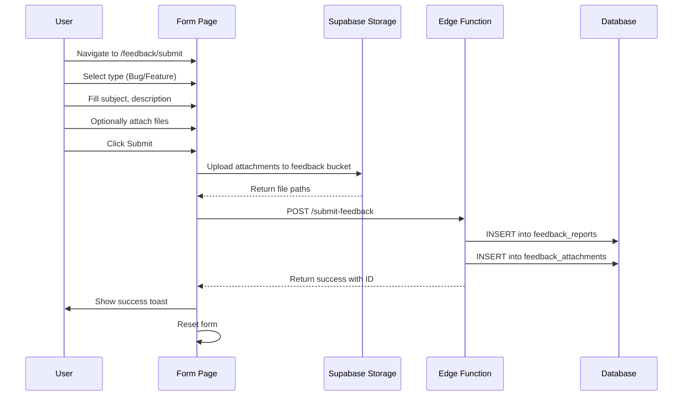
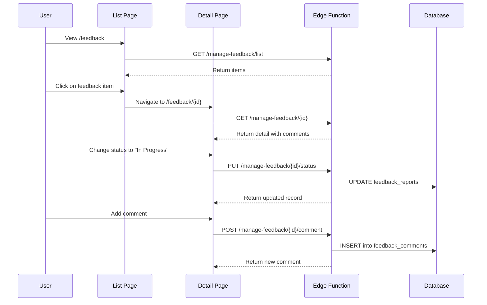
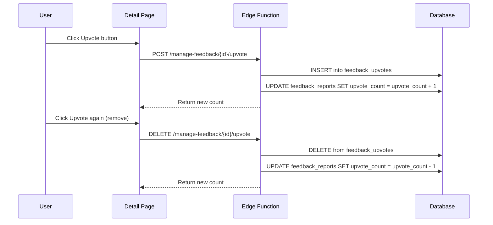

# Feedback Module Documentation

> **Purpose**: A unified internal bug tracking and feature request system enabling transparent team collaboration for triaging, prioritizing, and resolving product feedback.

---

## Table of Contents

1. [Overview](#overview)
2. [Architecture](#architecture)
3. [Data Model](#data-model)
4. [User Interface Components](#user-interface-components)
5. [User Flows](#user-flows)
6. [API Reference](#api-reference)
7. [Security & Access Control](#security--access-control)
8. [Design System](#design-system)
9. [Implementation Guide](#implementation-guide)

---

## Overview

### Purpose

The Feedback Module provides a centralized system for:
- **Bug Reports**: Track issues, glitches, and broken workflows
- **Feature Requests**: Collect enhancement ideas and improvement suggestions
- **Team Collaboration**: Enable all authenticated users to view, comment, upvote, and triage feedback

### Key Principles

| Principle | Description |
|-----------|-------------|
| **Transparency** | All authenticated users can view all feedback items |
| **Collaborative Triage** | Any team member can update status/priority, not just admins |
| **Simple Workflow** | Four-stage status lifecycle: Open → In Progress → Resolved → Closed |
| **Engagement Tracking** | Upvotes and comments to gauge priority and facilitate discussion |

### Feature Flags

The module respects a feature flag `feedback_enabled` that can disable the entire section when needed.

---

## Architecture

### File Structure

```
src/
├── pages/feedback/
│   ├── FeedbackDashboard.tsx    # Main dashboard with stats, overview, and list
│   ├── FeedbackDetail.tsx       # Single feedback item detail view
│   └── SubmitFeedback.tsx       # Submission form for new feedback
├── components/feedback/
│   ├── FeedbackStatsCards.tsx   # Summary metric cards (4 KPI cards)
│   ├── FeedbackStatusOverview.tsx # Progress bars by status
│   ├── FeedbackQuickSubmit.tsx  # Quick action cards for submission
│   ├── FeedbackListSection.tsx  # Tabbed list with pagination
│   ├── FeedbackListItem.tsx     # Individual list row item
│   ├── FeedbackFilters.tsx      # Status and module filter dropdowns
│   └── UpvoteButton.tsx         # Upvote toggle button
├── features/feedback/
│   ├── api.ts                   # API client functions
│   ├── constants.ts             # Module options and status labels
│   └── components/
│       ├── FeedbackDetailCard.tsx  # Detail view card with editing
│       ├── FeedbackComments.tsx    # Comment thread
│       └── FeedbackBreadcrumb.tsx  # Navigation breadcrumb
```

### Technology Stack

| Layer | Technology |
|-------|------------|
| Frontend | React 18, TypeScript, TailwindCSS |
| UI Components | shadcn/ui (Card, Badge, Button, Select, Tabs) |
| State Management | TanStack Query (React Query) |
| Routing | React Router v6 |
| Backend | Supabase Edge Functions |
| Database | PostgreSQL (via Supabase) |
| Storage | Supabase Storage (attachments) |

---

## Data Model

### Database Schema

#### `feedback_reports` Table

| Column | Type | Description |
|--------|------|-------------|
| `id` | UUID (PK) | Unique identifier |
| `feedback_number` | SERIAL | Auto-incrementing display number |
| `type` | TEXT | `bug` or `feature` |
| `subject` | TEXT | Short summary (max 180 chars) |
| `description` | TEXT | Detailed explanation |
| `status` | TEXT | `open`, `in_review`, `resolved`, `closed` |
| `priority` | TEXT | `low`, `medium`, `high`, or NULL |
| `module` | TEXT | Categorization by product area |
| `email` | TEXT | Submitter's email |
| `upvote_count` | INTEGER | Cached upvote count (default 0) |
| `attachment_url` | TEXT | Legacy single attachment path |
| `created_by` | UUID (FK) | User who submitted |
| `reviewed_by` | UUID (FK) | User currently handling |
| `created_at` | TIMESTAMPTZ | Submission timestamp |
| `updated_at` | TIMESTAMPTZ | Last modification |
| `deleted_at` | TIMESTAMPTZ | Soft delete timestamp |

#### `feedback_comments` Table

| Column | Type | Description |
|--------|------|-------------|
| `id` | UUID (PK) | Unique identifier |
| `feedback_id` | UUID (FK) | Parent feedback report |
| `user_id` | UUID (FK) | Comment author |
| `comment` | TEXT | Comment content |
| `created_at` | TIMESTAMPTZ | Creation timestamp |

#### `feedback_upvotes` Table

| Column | Type | Description |
|--------|------|-------------|
| `feedback_id` | UUID (PK, FK) | Feedback being upvoted |
| `user_id` | UUID (PK, FK) | User who upvoted |
| `created_at` | TIMESTAMPTZ | Upvote timestamp |

#### `feedback_attachments` Table

| Column | Type | Description |
|--------|------|-------------|
| `id` | UUID (PK) | Unique identifier |
| `feedback_id` | UUID (FK) | Parent feedback report |
| `file_name` | TEXT | Original file name |
| `file_path` | TEXT | Storage path |
| `file_size` | INTEGER | File size in bytes |
| `content_type` | TEXT | MIME type |
| `created_at` | TIMESTAMPTZ | Upload timestamp |

### TypeScript Types

```typescript
// Core types
type FeedbackType = "bug" | "feature";
type FeedbackStatus = "open" | "in_review" | "resolved" | "closed";
type FeedbackPriority = "low" | "medium" | "high";

interface FeedbackReport {
  id: string;
  type: FeedbackType;
  subject: string;
  description: string | null;
  status: FeedbackStatus;
  priority?: FeedbackPriority | null;
  module?: string | null;
  feedback_number?: number | null;
  upvote_count?: number | null;
  comment_count?: number | null;
  email: string | null;
  attachment_url: string | null;
  created_by: string;
  reviewed_by: string | null;
  created_at: string;
  updated_at: string;
  deleted_at: string | null;
  submitted_by_name?: string | null;
  reviewed_by_name?: string | null;
}

interface FeedbackComment {
  id: string;
  feedback_id: string;
  user_id: string;
  comment: string;
  created_at: string;
  author_name?: string | null;
  author_email?: string | null;
}

interface AttachmentInfo {
  fileName: string;
  filePath: string;
  fileSize?: number;
  contentType?: string;
}
```

### Constants

```typescript
// Module categorization options
const FEEDBACK_MODULE_OPTIONS = [
  { value: "Tasks", label: "Tasks" },
  { value: "LinkedIn", label: "LinkedIn" },
  { value: "EOD", label: "EOD" },
  { value: "Campaigns", label: "Campaigns" },
  { value: "Analytics", label: "Analytics" },
  { value: "Reporting", label: "Reporting" },
  { value: "Notifications", label: "Notifications" },
  { value: "General", label: "General" },
];

// Status display labels
const FEEDBACK_STATUS_LABELS = {
  open: "Open",
  in_review: "In Progress",
  resolved: "Resolved",
  closed: "Closed",
};
```

---

## User Interface Components

### 1. Dashboard Page (`/feedback`)

The main entry point displaying a complete overview of all feedback.

#### Layout Structure

```
┌─────────────────────────────────────────────────────────────┐
│ Header: "Feedback"                                          │
│ Subtitle: "One shared view for the team..."                 │
├─────────────────────────────────────────────────────────────┤
│ Stats Cards Row (4 cards)                                   │
│ ┌──────────┐ ┌──────────┐ ┌──────────┐ ┌──────────┐        │
│ │Open Bugs │ │Open      │ │In        │ │Resolved  │        │
│ │    12    │ │Features  │ │Progress  │ │    45    │        │
│ │2 high pri│ │    8     │ │    5     │ │Completed │        │
│ └──────────┘ └──────────┘ └──────────┘ └──────────┘        │
├─────────────────────────────────────────────────────────────┤
│ Quick Submit Cards (2 cards)                                │
│ ┌───────────────────────┐ ┌───────────────────────┐        │
│ │ Bug Reports           │ │ Feature Requests      │        │
│ │ [Submit Bug Report]   │ │ [Submit Feature Req]  │        │
│ └───────────────────────┘ └───────────────────────┘        │
├─────────────────────────────────────────────────────────────┤
│ Status Overview (2 progress cards)                          │
│ ┌───────────────────────┐ ┌───────────────────────┐        │
│ │ Bug Reports           │ │ Feature Requests      │        │
│ │ Open ████████░░ 12    │ │ Open ██████░░░░ 8     │        │
│ │ In Progress ██░░ 3    │ │ In Progress ██░░ 2   │        │
│ │ Resolved ████████ 40  │ │ Resolved █████ 25    │        │
│ │ Closed ██░░░░░░░ 5    │ │ Closed ██░░░░░░ 3    │        │
│ └───────────────────────┘ └───────────────────────┘        │
├─────────────────────────────────────────────────────────────┤
│ Feedback List Section                                       │
│ ┌─────────────────────────────────────────────────────────┐│
│ │ [Bugs (12)] [Features (8)] [All (85)]    [Filters ▾]   ││
│ ├─────────────────────────────────────────────────────────┤│
│ │ Open (7 items)                                          ││
│ │ ┌─────────────────────────────────────────────────────┐ ││
│ │ │ [Bug] #42 [Tasks] [Open]                            │ ││
│ │ │ Login button not working on mobile                   │ ││
│ │ │ Users report the login button is unresponsive...     │ ││
│ │ │ 👍 5  💬 3                           Jan 15, 2026   │ ││
│ │ └─────────────────────────────────────────────────────┘ ││
│ │ ...more items                                           ││
│ ├─────────────────────────────────────────────────────────┤│
│ │ In Progress (5 items)                                   ││
│ │ ...items                                                ││
│ ├─────────────────────────────────────────────────────────┤│
│ │ Showing 1 to 10 of 25 results                           ││
│ │ [<] [1] [2] [3] [4] [5] [>]                            ││
│ └─────────────────────────────────────────────────────────┘│
└─────────────────────────────────────────────────────────────┘
```

#### Component: FeedbackStatsCards

Four metric cards showing:

| Card | Value | Detail |
|------|-------|--------|
| Open Bugs | Count of bugs with status=open | X high priority |
| Open Features | Count of features with status=open | X total requests |
| In Progress | Count of all items with status=in_review | Bugs + features |
| Resolved | Count of all items with status=resolved | Completed |

**Styling**:
- Icons: `Bug` (red), `Sparkles` (amber), `TrendingUp` (blue), `CheckCircle2` (emerald)
- Grid: 4 columns on xl, 2 on md, 1 on mobile

#### Component: FeedbackQuickSubmit

Two action cards for quick submission:

| Card | Icon | Link |
|------|------|------|
| Bug Reports | `Bug` | `/feedback/submit?type=bug` |
| Feature Requests | `Sparkles` | `/feedback/submit?type=feature` |

#### Component: FeedbackStatusOverview

Two side-by-side cards showing progress bars:

- **Bug Reports**: Progress bars for each status with counts
- **Feature Requests**: Progress bars for each status with counts

Progress calculation: `percent = (statusCount / totalCount) * 100`

#### Component: FeedbackListSection

Tabbed list with filtering and pagination:

**Tabs**:
| Tab | Shows | Count Logic |
|-----|-------|-------------|
| Bugs | Bug items with status `open` or `in_review` | Active bugs only |
| Features | Feature items with status `open` or `in_review` | Active features only |
| All | All items regardless of status | Total count |

**Filters**:
- Status dropdown: All, Open, In Progress, Resolved, Closed
- Module dropdown: All modules + dynamic list from data

**Pagination**:
- Page size: 10 items
- Shows "Showing X to Y of Z results"
- Previous/Next buttons with page number links

**Grouping**:
Items are grouped by status with section headers showing count.

### 2. Submit Page (`/feedback/submit`)

Form for creating new bug reports or feature requests.

#### Layout Structure

```
┌─────────────────────────────────────────────────────────────┐
│ Card with glass effect (border-primary/20 bg-card/80)       │
├─────────────────────────────────────────────────────────────┤
│ Header                                                       │
│ Title: "Share feedback with the platform team"              │
│ Description: "Quickly report issues or request..."          │
│ [View All Feedback] button (top right)                      │
├─────────────────────────────────────────────────────────────┤
│ Type Tabs                                                    │
│ ┌──────────────────┬──────────────────┐                     │
│ │ 🐛 Report a bug  │ ✨ Request feat  │                     │
│ └──────────────────┴──────────────────┘                     │
├─────────────────────────────────────────────────────────────┤
│ Form Fields                                                  │
│ ┌────────────────────┬────────────────────┐                 │
│ │ Your email (ro)    │ Submitted on (ro)  │                 │
│ └────────────────────┴────────────────────┘                 │
│ ┌─────────────────────────────────────────┐                 │
│ │ Module (optional) ▼                     │                 │
│ └─────────────────────────────────────────┘                 │
│ ┌─────────────────────────────────────────┐                 │
│ │ Subject *                               │                 │
│ └─────────────────────────────────────────┘                 │
│ ┌─────────────────────────────────────────┐                 │
│ │ Details (optional)                      │                 │
│ │                                         │                 │
│ │                                         │                 │
│ └─────────────────────────────────────────┘                 │
│ ┌─────────────────────────────────────────┐                 │
│ │ Attachments (optional) [Choose Files]   │                 │
│ └─────────────────────────────────────────┘                 │
│ Selected files list with remove buttons                      │
├─────────────────────────────────────────────────────────────┤
│ Footer                                                       │
│ "By submitting..." disclaimer        [Submit feedback]      │
└─────────────────────────────────────────────────────────────┘
```

#### Form Fields

| Field | Type | Required | Validation |
|-------|------|----------|------------|
| Type | Tabs (bug/feature) | Yes | Must be valid type |
| Email | Input (readonly) | Auto | From auth user |
| Submitted on | Input (readonly) | Auto | Current timestamp |
| Module | Select | No | From FEEDBACK_MODULE_OPTIONS |
| Subject | Input | Yes | Max 180 characters |
| Details | Textarea | No | Multi-line |
| Attachments | File input | No | Multiple, images/pdf/zip/log/txt |

#### Attachment Handling

1. Files stored in Supabase Storage bucket `feedback`
2. Path pattern: `{feedbackId}/{normalizedFileName}`
3. File name normalization: lowercase, alphanumeric + hyphens only
4. Multiple files supported with add/remove UI

### 3. Detail Page (`/feedback/:id`)

View and manage a single feedback item.

#### Layout Structure

```
┌─────────────────────────────────────────────────────────────┐
│ Navigation                                                   │
│ [←] Feedback / [Bug] Login issue                            │
├─────────────────────────────────────────────────────────────┤
│ Two-column layout (lg:grid-cols-[1fr,1.2fr])                │
├────────────────────────┬────────────────────────────────────┤
│ Detail Card            │ Comments Card                      │
│ ┌────────────────────┐ │ ┌────────────────────────────────┐ │
│ │ 🕐 Subject         │ │ │ Conversation                   │ │
│ │ [Upvote 5]         │ │ │ ┌──────────────────────────┐   │ │
│ │                    │ │ │ │ John D. • Jan 15         │   │ │
│ │ [Bug] #42 [Open]   │ │ │ │ Thanks for reporting...  │   │ │
│ │ [Tasks] [High]     │ │ │ └──────────────────────────┘   │ │
│ ├────────────────────┤ │ │ ┌──────────────────────────┐   │ │
│ │ Submitted by:      │ │ │ │ Jane S. • Jan 16         │   │ │
│ │ john@example.com   │ │ │ │ I've started looking...  │   │ │
│ │                    │ │ │ └──────────────────────────┘   │ │
│ │ Submitted on:      │ │ │ ...more comments               │ │
│ │ Jan 15, 2026       │ │ ├────────────────────────────────┤ │
│ ├────────────────────┤ │ │ Add a reply                    │ │
│ │ Description        │ │ │ ┌──────────────────────────┐   │ │
│ │ The login button...│ │ │ │ Type your message...     │   │ │
│ ├────────────────────┤ │ │ └──────────────────────────┘   │ │
│ │ Attachments (2)    │ │ │ [Post Reply]                   │ │
│ │ [📥 screenshot.png]│ │ └────────────────────────────────┘ │
│ │ [📥 logs.txt]      │ │                                    │
│ ├────────────────────┤ │                                    │
│ │ Status: [Open ▼]   │ │                                    │
│ │ Priority: [High ▼] │ │                                    │
│ │ Module: [Tasks ▼]  │ │                                    │
│ ├────────────────────┤ │                                    │
│ │ [Mark resolved]    │ │                                    │
│ │ [Archive] (admin)  │ │                                    │
│ └────────────────────┘ │                                    │
└────────────────────────┴────────────────────────────────────┘
```

#### Permissions

| Action | Who Can Perform |
|--------|-----------------|
| View feedback | All authenticated users |
| Update status | All authenticated users |
| Update priority | All authenticated users |
| Update module | All authenticated users |
| Add comments | All authenticated users |
| Upvote/Remove upvote | All authenticated users |
| Archive (soft delete) | super_admin only |

---

## User Flows

### Flow 1: Submit Feedback



### Flow 2: Triage Feedback



### Flow 3: Upvote Feedback



---

## API Reference

### Edge Functions

#### `submit-feedback`

Creates a new feedback report.

```typescript
// Request
POST /submit-feedback
{
  id?: string;           // Optional pre-generated UUID
  type: "bug" | "feature";
  subject: string;
  description?: string;
  module?: string;
  attachments?: AttachmentInfo[];
}

// Response
{
  id: string;
  status: FeedbackStatus;
}
```

#### `manage-feedback`

CRUD operations for feedback management.

```typescript
// List feedback
GET /manage-feedback/list
Query params:
  - type?: "bug" | "feature"
  - status?: FeedbackStatus
  - statuses?: string (comma-separated)
  - module?: string
  - includeClosed?: boolean
  - page?: number
  - pageSize?: number
  - search?: string

// Get detail
GET /manage-feedback/{id}

// Update status
PUT /manage-feedback/{id}/status
{ status: FeedbackStatus }

// Update priority
PUT /manage-feedback/{id}/priority
{ priority: FeedbackPriority | null }

// Update module
PUT /manage-feedback/{id}/module
{ module: string | null }

// Add comment
POST /manage-feedback/{id}/comment
{ comment: string }

// Add upvote
POST /manage-feedback/{id}/upvote

// Remove upvote
DELETE /manage-feedback/{id}/upvote

// Soft delete (archive)
DELETE /manage-feedback/{id}
```

### Client API Functions

```typescript
// Submit new feedback
submitFeedback(payload: SubmitFeedbackPayload): Promise<{ id: string; status: FeedbackStatus }>

// List feedback with filters
listFeedbackReports(params: ListParams): Promise<FeedbackListResponse>

// Get single feedback detail
getFeedbackDetail(id: string): Promise<FeedbackDetailResponse>

// Post comment
postFeedbackComment(id: string, comment: string): Promise<FeedbackComment>

// Update status
updateFeedbackStatus(id: string, status: FeedbackStatus): Promise<FeedbackReport>

// Update priority
updateFeedbackPriority(id: string, priority: FeedbackPriority | null): Promise<FeedbackReport>

// Update module
updateFeedbackModule(id: string, module: string | null): Promise<FeedbackReport>

// Toggle upvote
addFeedbackUpvote(id: string): Promise<{ upvote_count: number }>
removeFeedbackUpvote(id: string): Promise<{ upvote_count: number }>

// Soft delete
deleteFeedback(id: string): Promise<{ success: boolean }>
```

---

## Security & Access Control

### Row Level Security (RLS) Policies

#### feedback_reports

| Policy | Action | Condition |
|--------|--------|-----------|
| View | SELECT | `auth.uid() IS NOT NULL AND deleted_at IS NULL` |
| Create | INSERT | `auth.uid() = created_by` |
| Update | UPDATE | `auth.uid() IS NOT NULL AND deleted_at IS NULL` |
| Delete | DELETE | `has_role(auth.uid(), 'super_admin')` |

#### feedback_comments

| Policy | Action | Condition |
|--------|--------|-----------|
| View | SELECT | `auth.uid() IS NOT NULL` |
| Create | INSERT | `auth.uid() = user_id` |

#### feedback_upvotes

| Policy | Action | Condition |
|--------|--------|-----------|
| View | SELECT | `auth.uid() IS NOT NULL` |
| Create | INSERT | `auth.uid() = user_id` |
| Delete | DELETE | `auth.uid() = user_id` |

### Authentication Requirements

- All endpoints require valid JWT authentication
- Session tokens are refreshed before submission to prevent expiry issues
- Feature flag `feedback_enabled` can disable module globally

---

## Design System

### Color Palette

#### Status Colors

| Status | Light Mode | Dark Mode |
|--------|------------|-----------|
| Open | `bg-blue-100 text-blue-700` | `bg-blue-900/40 text-blue-100` |
| In Progress | `bg-amber-100 text-amber-800` | `bg-amber-900/40 text-amber-100` |
| Resolved | `bg-emerald-100 text-emerald-800` | `bg-emerald-900/40 text-emerald-100` |
| Closed | `bg-slate-200 text-slate-700` | `bg-slate-800/60 text-slate-100` |

#### Priority Colors

| Priority | Light Mode | Dark Mode |
|----------|------------|-----------|
| Low | `bg-gray-100 text-gray-700` | `bg-gray-900/40 text-gray-100` |
| Medium | `bg-yellow-100 text-yellow-800` | `bg-yellow-900/40 text-yellow-100` |
| High | `bg-red-100 text-red-800` | `bg-red-900/40 text-red-100` |

#### Type Colors

| Type | Variant |
|------|---------|
| Bug | `Badge variant=\"destructive\"` |
| Feature | `Badge variant=\"default\"` |

### Icon Usage

| Context | Icon | Package |
|---------|------|---------|
| Bug reports | `Bug` | lucide-react |
| Feature requests | `Sparkles` | lucide-react |
| In Progress | `TrendingUp` | lucide-react |
| Resolved | `CheckCircle2` | lucide-react |
| Upvote | `ThumbsUp` | lucide-react |
| Comments | `MessageSquare` | lucide-react |
| Download | `Download` | lucide-react |
| Back navigation | `ArrowLeft` | lucide-react |
| Time/Clock | `Clock` | lucide-react |

### Component Patterns

#### Cards
- Use `Card`, `CardHeader`, `CardContent`, `CardTitle`, `CardDescription` from shadcn
- Stats cards: Icon in header, large value number, detail text below

#### Badges
- Type badge: `destructive` for bugs, `default` for features
- Status badge: Custom color classes based on status
- Module badge: `variant=\"secondary\"`
- Priority badge: Custom color classes based on priority

#### Lists
- Items are clickable links with hover border effect
- Show badges for type, module, status
- Display subject with line-clamp-1
- Show engagement (upvotes, comments) and date

#### Forms
- Use shadcn `Input`, `Textarea`, `Select`, `Button`
- Readonly fields for auto-filled values
- Clear error handling with toast notifications

---

## Implementation Guide

### Step 1: Database Setup

Execute migration to create tables with RLS:

```sql
-- Create feedback_reports table
CREATE TABLE public.feedback_reports (
  id UUID PRIMARY KEY DEFAULT gen_random_uuid(),
  feedback_number SERIAL,
  type TEXT NOT NULL CHECK (type IN ('bug', 'feature')),
  subject TEXT NOT NULL,
  description TEXT,
  status TEXT NOT NULL DEFAULT 'open' CHECK (status IN ('open', 'in_review', 'resolved', 'closed')),
  priority TEXT CHECK (priority IN ('low', 'medium', 'high')),
  module TEXT,
  email TEXT,
  upvote_count INTEGER DEFAULT 0,
  attachment_url TEXT,
  created_by UUID NOT NULL,
  reviewed_by UUID,
  created_at TIMESTAMPTZ DEFAULT now(),
  updated_at TIMESTAMPTZ DEFAULT now(),
  deleted_at TIMESTAMPTZ
);

-- Create feedback_comments table
CREATE TABLE public.feedback_comments (
  id UUID PRIMARY KEY DEFAULT gen_random_uuid(),
  feedback_id UUID REFERENCES feedback_reports(id) ON DELETE CASCADE,
  user_id UUID NOT NULL,
  comment TEXT NOT NULL,
  created_at TIMESTAMPTZ DEFAULT now()
);

-- Create feedback_upvotes table
CREATE TABLE public.feedback_upvotes (
  feedback_id UUID REFERENCES feedback_reports(id) ON DELETE CASCADE,
  user_id UUID NOT NULL,
  created_at TIMESTAMPTZ DEFAULT now(),
  PRIMARY KEY (feedback_id, user_id)
);

-- Create feedback_attachments table
CREATE TABLE public.feedback_attachments (
  id UUID PRIMARY KEY DEFAULT gen_random_uuid(),
  feedback_id UUID REFERENCES feedback_reports(id) ON DELETE CASCADE,
  file_name TEXT NOT NULL,
  file_path TEXT NOT NULL,
  file_size INTEGER,
  content_type TEXT,
  created_at TIMESTAMPTZ DEFAULT now()
);

-- Enable RLS
ALTER TABLE public.feedback_reports ENABLE ROW LEVEL SECURITY;
ALTER TABLE public.feedback_comments ENABLE ROW LEVEL SECURITY;
ALTER TABLE public.feedback_upvotes ENABLE ROW LEVEL SECURITY;
ALTER TABLE public.feedback_attachments ENABLE ROW LEVEL SECURITY;

-- Create RLS policies (see Security section for details)
```

### Step 2: Storage Setup

Create storage bucket for attachments:

```sql
INSERT INTO storage.buckets (id, name, public) 
VALUES ('feedback', 'feedback', false);

-- Storage policies for authenticated users
CREATE POLICY "Users can upload feedback attachments"
ON storage.objects FOR INSERT
WITH CHECK (bucket_id = 'feedback' AND auth.uid() IS NOT NULL);

CREATE POLICY "Users can view feedback attachments"
ON storage.objects FOR SELECT
USING (bucket_id = 'feedback' AND auth.uid() IS NOT NULL);
```

### Step 3: Edge Functions

Deploy edge functions for API endpoints:
- `submit-feedback` - Handle creation
- `manage-feedback` - Handle CRUD operations

### Step 4: Frontend Components

1. Create page routes in React Router
2. Implement dashboard with stats, overview, and list
3. Implement submission form with file upload
4. Implement detail page with comments and editing

### Step 5: Feature Flag

Add `feedback_enabled` to feature flags table and implement check in components.

---

## Extending the Module

### Adding New Modules

Update `FEEDBACK_MODULE_OPTIONS` in `constants.ts`:

```typescript
export const FEEDBACK_MODULE_OPTIONS = [
  // ... existing options
  { value: "NewModule", label: "New Module" },
];
```

### Adding New Statuses

1. Update type definition
2. Add to `FEEDBACK_STATUS_LABELS`
3. Add color mapping in components
4. Update database CHECK constraint

### Adding Email Notifications

The module supports `feedback_auto_email` feature flag for confirmation emails. Implement email sending in edge function.

---

## Related Documentation

- [Rich Text Editor Guide](../RICH_TEXT_EDITOR_GUIDE.md)
- [Task Comment Tagging Guide](../TASK_COMMENT_TAGGING_GUIDE.md)
